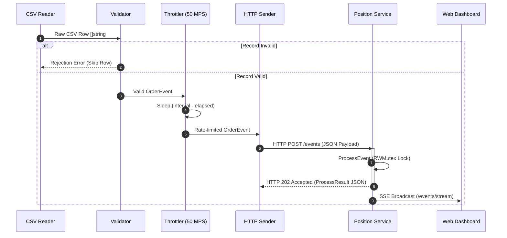
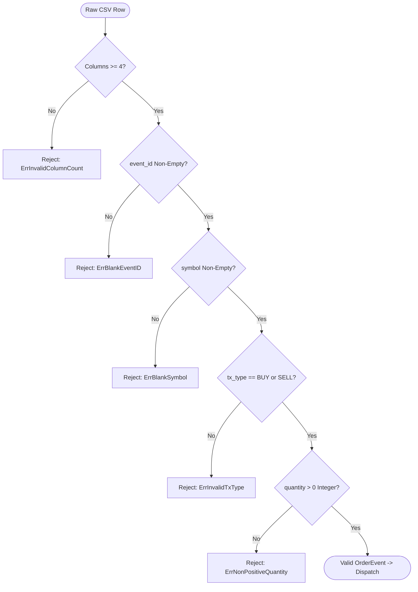
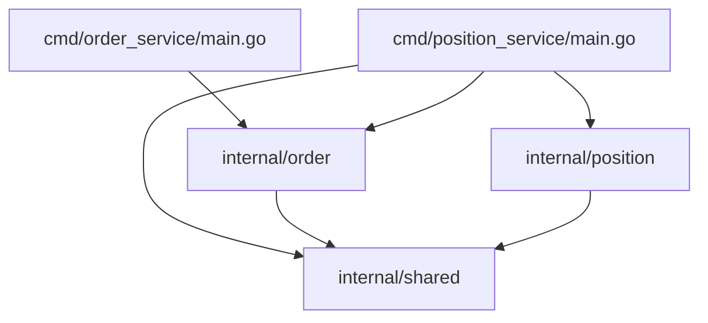
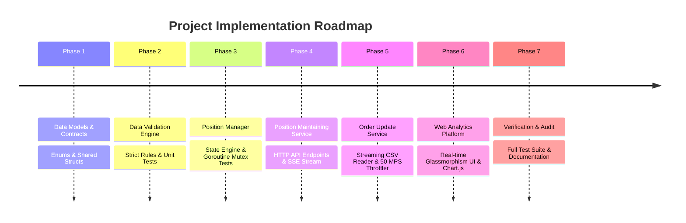

# Architectural Diagrams & Visual Workflows

This document consolidates all Mermaid visual diagrams illustrating the High-Level Design (HLD), Low-Level Design (LLD), sequence flows, validation decision trees, and state lifecycles of the Go Order Position Engine.

---

## 1. High-Level System Topology Diagram (HLD)

```mermaid
flowchart TD
    subgraph Data Source
        CSV[order_updates.csv]
    end

    subgraph Order Update Service (Producer Process)
        Reader[Incremental CSV Reader O(1) RAM]
        Val[Data Contract Validator]
        Throttle[Rate Limit Throttler - 50 MPS]
        Sender[HTTP POST Dispatcher]

        CSV -->|Line by Line| Reader
        Reader --> Val
        Val -->|Valid Event| Throttle
        Throttle --> Sender
    end

    subgraph Position Maintaining Service (Consumer Process)
        Handler[POST /events Endpoint]
        Manager[Position & Idempotency Engine]
        Store[(In-Memory State: map[string]int)]
        Dedup[(Idempotency Set: map[string]struct{})]
        GetAPI[GET /position Endpoint]
        SSE[Server-Sent Events Broadcast]

        Sender -->|HTTP POST /events| Handler
        Handler --> Manager
        Manager <--> Store
        Manager <--> Dedup
        Manager --> SSE
    end

    subgraph Web Analytics Dashboard
        UI[Browser UI & Chart.js]
        GetAPI -->|Fetch Positions| UI
        SSE -->|Live Event Stream| UI
    end
```

---

## 2. Inter-Service Communication Sequence Diagram



---

## 3. Order Data Validation Decision Tree



---

## 4. Position State Engine & Idempotency Lifecycle

```mermaid
flowchart TD
    In([OrderEvent Received]) --> Lock[Acquire RWMutex Write Lock]
    Lock --> CheckDup{event_id in seenEvents?}
    CheckDup -- Yes --> DupRes[Return StatusDuplicate | NetPosition unchanged]
    CheckDup -- No --> RecordID[Add event_id to seenEvents map]
    RecordID --> CheckTx{TransactionType?}
    CheckTx -- BUY --> Add[positions[symbol] += quantity]
    CheckTx -- SELL --> Sub[positions[symbol] -= quantity]
    Add --> AccRes[Return StatusAccepted | Updated NetPosition]
    Sub --> AccRes
    DupRes --> Unlock[Release RWMutex Lock]
    AccRes --> Unlock
```

---

## 5. Package Dependency Hierarchy Diagram



---

## 6. Implementation Phases Roadmap Timeline


