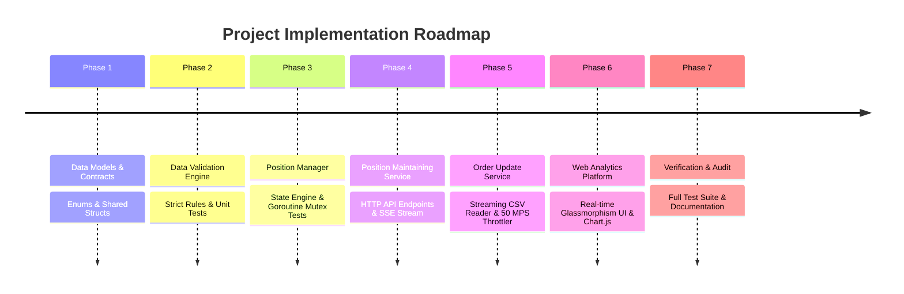

# Development Phases & Roadmap

This document outlines the step-by-step development phases, execution commands, and testing walkthrough for the project.

---

## 1. Development Roadmap (Phases 1 to 7)



### Phase Details:
- **Phase 1: Shared Models**: Defined `OrderEvent`, `ProcessResult`, `TransactionType` enum (`BUY`, `SELL`), and `EventProcessStatus` in [`internal/shared/models.go`](file:///d:/SDE%20Intern/internal/shared/models.go).
- **Phase 2: Validation Module**: Developed [`internal/order/validator.go`](file:///d:/SDE%20Intern/internal/order/validator.go) enforcing blank checks, enum matching, positive integers, and wrote unit test suite [`validator_test.go`](file:///d:/SDE%20Intern/internal/order/validator_test.go).
- **Phase 3: Position Manager**: Built [`internal/position/manager.go`](file:///d:/SDE%20Intern/internal/position/manager.go) using `sync.RWMutex` and idempotency set. Wrote concurrency unit tests [`manager_test.go`](file:///d:/SDE%20Intern/internal/position/manager_test.go).
- **Phase 4: Consumer Service**: Developed [`cmd/position_service/main.go`](file:///d:/SDE%20Intern/cmd/position_service/main.go) and [`internal/position/handler.go`](file:///d:/SDE%20Intern/internal/position/handler.go) exposing `/events`, `/position`, and `/events/stream`.
- **Phase 5: Producer Service**: Built [`internal/order/csv_reader.go`](file:///d:/SDE%20Intern/internal/order/csv_reader.go), [`throttler.go`](file:///d:/SDE%20Intern/internal/order/throttler.go), and [`sender.go`](file:///d:/SDE%20Intern/internal/order/sender.go).
- **Phase 6: Web Dashboard**: Created real-time UI in [`web/index.html`](file:///d:/SDE%20Intern/web/index.html) and [`web/app.js`](file:///d:/SDE%20Intern/web/app.js).
- **Phase 7: Verification**: Executed automated test suites and generated documentation.

---

## 2. Setup & Execution Walkthrough

### Step 1: Start Position Service
```powershell
go run cmd/position_service/main.go --port=8080
```

### Step 2: Launch Order Producer Streamer
```powershell
go run cmd/order_service/main.go --csv-file="order_updates (1).csv" --target-url="http://localhost:8080/events" --rate-limit-mps=50
```

### Step 3: Run Automated Unit Tests
```powershell
go test -v ./...
```

### Step 4: Verify API Endpoints via curl
```bash
# Ingest single event
curl -X POST http://localhost:8080/events \
  -H "Content-Type: application/json" \
  -d '{"event_id":"evt-1","symbol":"RELIANCE","transaction_type":"BUY","quantity":90}'

# Fetch net positions
curl http://localhost:8080/position
```
